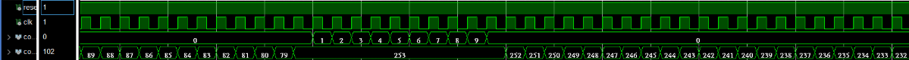
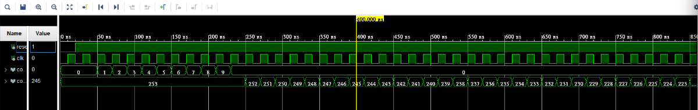

# HW1: Sequential Multi-Stage Counters (多階段循序計數器)

## 📖 專案簡介 (Introduction)
本專案實作一個基於有限狀態機 (FSM) 的多階段計數系統。系統包含三個獨立的計數器，依序執行並循環運作。此練習旨在熟悉 Verilog 中的狀態機控制與計數器邏輯設計。
(This project implements a sequential counting system based on a Finite State Machine. It consists of three counters running in a loop.)

## 🚀 功能規格 (Specifications)
系統透過狀態機控制以下三個計數階段的循環切換：

1.  **Stage 1 (Count1):** 上數計數器 (Up Counter)，範圍 `0` 到 `9`。
    * 當數值達到 9 時，觸發訊號切換至下一階段。
2.  **Stage 2 (Count2):** 下數計數器 (Down Counter)，範圍 `253` 到 `79`。
    * 當數值遞減至 79 時，觸發訊號切換至下一階段。

## 🏗️ 系統架構與狀態機 (Architecture & FSM)

本設計使用 **Finite State Machine (FSM)** 來管理計數器的致能訊號 (Enable Signals)。

> **狀態說明：**
> * `S_IDLE`: 初始重置狀態。
> * `S_COUNT1`: 啟動計數器 1，直到數值 = 9。
> * `S_COUNT2`: 啟動計數器 2，直到數值 = 79。

## 📈 模擬波形 (Simulation Results)

此部分展示 ModelSim / Vivado 的模擬結果，驗證計數邏輯與狀態切換的正確性。

### 1. 完整循環展示 (Full Loop)

> **圖說：** 上圖顯示

### 2. 狀態切換細節 (Transition Detail)

> **圖說：** > * **左側：** 當 `cnt1` 數到 **9** 時，狀態由 `S_COUNT1` 轉變為 `S_COUNT2`，且 `cnt2` 預載入 **253** 開始倒數。
> * **右側：** 當 `cnt3` 數到 **21** 時，系統判定循環結束，自動跳回 `S_COUNT1`，`cnt1` 歸零重新開始。

## ⚙️ 開發環境 (Environment)
* **Language:** Verilog HDL
* **Simulation Tool:** ModelSim / Vivado Simulator
* **Synthesis Tool:** Quartus Prime / Vivado

## 🔧 如何執行 (How to Run)
1.  將所有 `.v` 檔案加入專案。
2.  編譯 `hw1_top.v` 與 Testbench。
3.  執行模擬並觀察 `count1`, `count2`, `count3` 以及 `state` 訊號。
