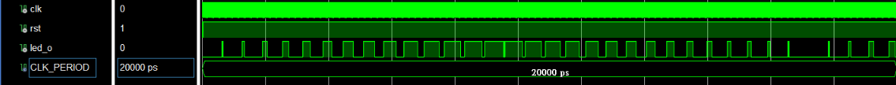

# HW2: FPGA Breathing LED (呼吸燈控制器)


## 📖 專案簡介 (Introduction)
本專案實作一個 **呼吸燈 (Breathing LED)** 效果。不同於一般的閃爍燈，呼吸燈透過 **PWM (Pulse Width Modulation)** 技術，讓 LED 的亮度呈現平滑漸亮與漸暗的視覺效果，模擬人類呼吸的節奏。

## 🚀 核心原理 (Core Logic)

系統主要由三個關鍵參數控制 LED 的行為：

1.  **`duty` (Duty Cycle / 亮度):**
    * 控制 LED 在一個 PWM 週期內亮起的時間比例。
    * `duty` 越大，LED 越亮；`duty` 越小，LED 越暗。
    * 在程式碼中對應 `upbnd1` 與 `upbnd2`。

2.  **`dir_up` (Direction / 狀態):**
    * 控制亮度的變化方向。
    * **Getting Bright (`dir_up = 1`):** `duty` 逐漸增加。
    * **Getting Dark (`dir_up = 0`):** `duty` 逐漸減少。
    * 在程式碼中對應 FSM 狀態 `state2` (`gettingBright`, `gettingDark`).

3.  **`pwm_cnt` (Speed Control / 呼吸速度):**
    * 用來控制更新 `duty` 的頻率。為了讓人眼能感受到平滑變化，我們不能每個 Clock 都改變亮度，必須每隔一段時間 (`pwm_cnt` 數完一輪) 才調整一次 `duty`。

## 🏗️ 系統架構 (Architecture)

### 模組階層
* **Top Module (`breath.vhd`):** 負責狀態機控制 (FSM) 與亮度參數計算。
* **Sub Module (`hw1_2cnters`):** 接收亮度邊界參數，產生實際的 PWM 波形訊號。

### 狀態機設計 (FSM)

*(建議在此處放入狀態轉換圖)*
* **Init:** 重置參數。
* **Getting Bright:** `duty` 逐步 +1，直到達到最大值 (`FF`)。
* **Getting Dark:** `duty` 逐步 -1，直到達到最小值 (`00`)。

## ⚙️ 硬體配置 (Pin Assignment)
根據 `test.xdc` 檔案：
* **Clock (`i_clk`):** `Y9` (System Clock)
* **Reset (`i_rst`):** `F22` (Active Low)
* **LED (`o_led`):** `T22` (PWM Output)

## 🔧 如何調整呼吸速度 (How to Adjust Speed)

呼吸燈的快慢取決於 **「多久改變一次亮度」** 以及 **「每次改變亮度的幅度」**。你可以透過修改 `breath.vhd` 來達到不同效果：

### 方法 1：更改等待週期 (Change Wait Cycles)
這是最細膩的調整方式。修改 `pwm_cnt` 的計數上限 (常數 `P`)。
* **原理：** `P` 值越大，等待時間越長，呼吸速度**越慢**。
* **程式碼位置：**
    ```vhdl
    -- breath.vhd Line 20
    constant P : STD_LOGIC_VECTOR (7 downto 0) := "00001111"; -- 目前設為 15
    ```
    * **變慢：** 改為 `"11111111"` (255)。
    * **變快：** 改為 `"00000011"` (3)。

### 方法 2：更改步進值 (Change Step Size)
這是較劇烈的調整方式。
* **原理：** 每次更新亮度時，不只加減 1，而是加減更多。步進值越大，從最暗到最亮所需的步數越少，呼吸速度**越快** (但可能會有顆粒感)。
* **程式碼位置：**
    ```vhdl
    -- breath.vhd Line 31 (upbnd1p process)
    if alreadyP_PWM_cycles = '1' then
        upbnd1 <= upbnd1 + '1'; -- 將 '1' 改為 '2' 或更大
    end if;
    ```

## 📈 模擬結果 (Simulation)
展示 `upbnd` (Duty) 隨時間變化的三角波形，以及對應的 PWM 輸出密度變化。


> **圖說：** 可以看到 `upbnd1` 呈現階梯狀上升與下降，對應的 `o_led` 脈衝寬度也隨之改變。

## 📜 License
MIT License
