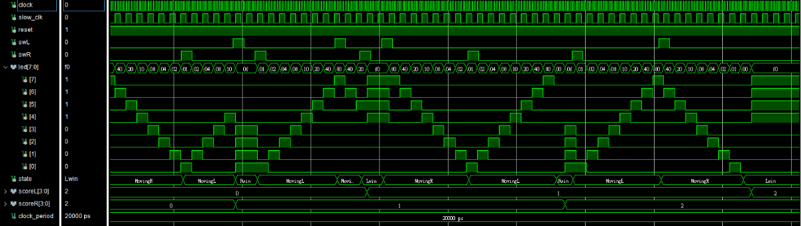

# HW3: FPGA Ping Pong Game (乒乓球對打遊戲)

## 📖 專案簡介 (Introduction)
本專案利用 FPGA 實作一個經典的雙人乒乓球對打遊戲。
系統使用 **8 顆 LED** 模擬乒乓球的移動軌跡，玩家需透過左右兩側的 **按鍵 (Button)** 作為球拍進行擊球。遊戲邏輯基於 **有限狀態機 (FSM)** 設計，能夠精確判斷擊球時機、判定得分以及處理發球流程。

## 🎮 遊戲規則 (Game Rules)
1.  **發球 (Serve):**
    * 遊戲開始或得分後，由 **贏家** 負責發球。
    * 按下對應側的按鍵，球 (LED) 開始移動。
2.  **擊球 (Hit):**
    * 當球移動到 **最邊緣的 LED** (左側為 `Bit 7`，右側為 `Bit 0`) 時，玩家必須按下按鍵將球擊回。
3.  **失誤判定 (Miss/Foul):**
    * **太早按 (Early Hit):** 球還沒到底就按鍵 -> **對方得分**。
    * **太晚按 (Miss):** 球已經到底且準備反彈，但沒按鍵 -> **對方得分**。

## 🏗️ 系統架構 (Architecture)

本系統由四大核心模組組成：

### 1. 時脈除頻器 (Clock Divider)
* 將 FPGA 的高頻 System Clock 分頻產生 `slow_clk`。
* **用途：** 控制 LED 的移動速度，讓人類肉眼可見並有反應時間。
* *註：模擬時使用 `cnt(1)` 以加快驗證，上板時使用 `cnt(23)`。*

### 2. 有限狀態機 (FSM)
[cite_start]系統運作依賴以下四個狀態循環： [cite: 55, 111]

| 狀態 (State) | 描述 (Description) | 轉移條件 (Transition) |
| :--- | :--- | :--- |
| **MovingR** | 球向右移動 (`LED` 往 `Bit 0` 移) | 若右方成功擊球 -> `MovingL` 若右方失誤 -> `Lwin` |
| **MovingL** | 球向左移動 (`LED` 往 `Bit 7` 移) | 若左方成功擊球 -> `MovingR` 若左方失誤 -> `Rwin` |
| **Lwin** | 左方得分 (右方失誤)，LED 顯示全亮或其他特效 | 等待左方按鍵發球 -> `MovingR` |
| **Rwin** | 右方得分 (左方失誤)，LED 顯示全亮或其他特效 | 等待右方按鍵發球 -> `MovingL` |

### 3. LED 控制邏輯 (LED Controller)
* 根據當前狀態 (`state`) 與 `slow_clk` 更新 LED 的亮燈位置。
* 使用 **Shift Operation (位移運算)** 來模擬球的移動。

### 4. 計分系統 (Scoring System)
* 當狀態進入 `Lwin` 或 `Rwin` 時，對應的 `scoreL` 或 `scoreR` 計數器加一。

## 📈 模擬波形分析 (Simulation Results)
下圖展示了完整的遊戲流程驗證：

**波形解讀：**
1.  **初始發球：** `state` 從 `Lwin` (初始) 開始，左方發球後進入 `MovingR`，LED 數值開始向右位移 (`80` -> `40` -> ... -> `01`)。
2.  **成功擊球：** 當 LED 為 `01` 時，`swR` 被按下，狀態正確切換為 `MovingL`，球反彈向左。
3.  **提早擊球犯規：** 在 `Time = 950ns` 左右，球還在中間，左方 (`swL`) 提早按下，導致狀態直接跳變為 `Rwin` (右方得分)。
4.  **重新發球：** 進入 `Rwin` 狀態後，系統等待 `swR` 訊號才再次進入 `MovingL` 開始新的一局。

## ⚙️ 硬體腳位需求 (Hardware Requirements)
* **Input:**
    * `i_clk`: 系統時脈 (50MHz)
    * `i_rst`: 系統重置 (Active Low)
    * `i_swL`: 左方玩家按鍵
    * `i_swR`: 右方玩家按鍵
* **Output:**
    * `o_led [7:0]`: 8 顆 LED 顯示球的位置

## 🔧 如何執行 (How to Run)
1.  開啟 Quartus / Vivado 專案。
2.  確保 `PingPong_for_on_board.vhd` 被設為 Top Module。
3.  修改 `CLK_DIV` 中的 `cnt` 位元選擇以調整遊戲難度 (速度)：
    * `cnt(23)`: 慢速 (簡單)
    * `cnt(22)`: 中速
    * `cnt(21)`: 快速 (困難)
4.  編譯並燒錄至 FPGA 開發板。

## 📜 License
MIT License
