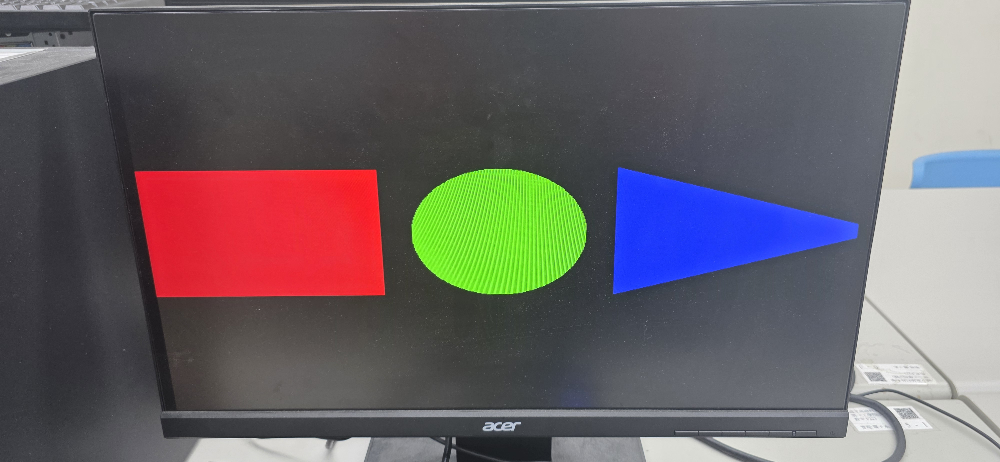

# HW4: FPGA VGA Graphics Controller (圖形顯示控制器)


## 📖 專案簡介 (Introduction)
本專案實作一個標準的 VGA 顯示控制器，解析度為 **640x480 @ 60Hz**。
不同於傳統顯示卡讀取記憶體 (Frame Buffer) 的方式，本設計採用 **「即時計算 (On-the-fly Rendering)」** 的技術。透過追蹤當前的掃描線位置 (`hCount`, `vCount`)，直接利用數學公式判定該像素 (Pixel) 應顯示的顏色，成功在螢幕上繪製出矩形、圓形與三角形。

## 🚀 功能特色 (Features)
* **標準 VGA 時序生成:** 產生 H-Sync 與 V-Sync 同步訊號。
* **幾何圖形繪製:**
    1.  **紅色矩形 (Red Rectangle):** 基於座標範圍判定。
    2.  **綠色圓形 (Green Circle):** 實作 $x^2 + y^2 < r^2$ 圓方程式邏輯。
    3.  **藍色三角形 (Blue Triangle):** 實作斜率與線性不等式邏輯。

## 📸 實作成果 (Demo)
下圖為 FPGA 開發板連接螢幕後的實際輸出畫面：



## 🏗️ 系統原理 (System Architecture)

### 1. 時脈分頻 (Clock Divider)
* VGA 640x480 @ 60Hz 的標準 Pixel Clock 為 **25 MHz**。
* 系統輸入時脈 (100MHz/50MHz) 透過 Counter 分頻產生 `vga_clk`。

### 2. VGA 時序控制 (Timing Generator)
定義了以下參數以符合 VGA 類比訊號標準：
* **Horizontal:** Visible (640) + Front Porch + Sync Pulse + Back Porch = Total (800)
* **Vertical:** Visible (480) + Front Porch + Sync Pulse + Back Porch = Total (525)

### 3. 圖形生成邏輯 (Pattern Generation)
利用 `process(hCount, vCount)` 判斷當前像素位置：

* **Left Zone (Rectangle):**
  ```vhdl
  if (hCount < hRez/3 ...) then red <= "1111";
